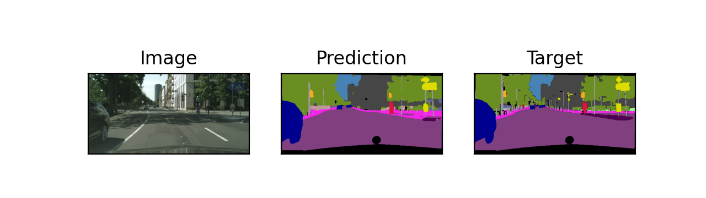

# ICNet_from_scratch

My implementation of ICNet

## Dataset: Cityscapes

## Results

This results are of PSPNet. ICNet is work in progress

    
     

## Results on Kitti dataset
model is trained on pspnet_resnet152 till epoch 20 on cityscapes. I evaluated on some of the kitti image.

    
     

    
     

    
     

    
     

